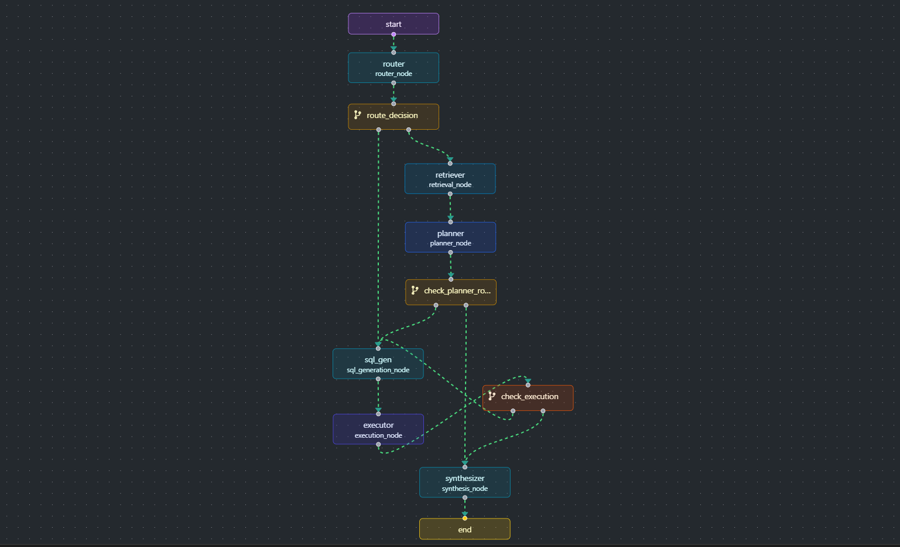

# SQL Multi-agent with Few-shot Optimization

1. Graph Design --with repair loop on SQL errors/parsing fails (up to 2x)...

2. Optimized DSPy Module: Router --classifier with BootstrapFewShot...
    - Metric: Classification Accuracy
    - Before: 50.00%
    - After:  83.33%
    - Delta:  +33.33%

3. The most valuable thing -- optimizing NL -> SQL using an LLM teatcher...

4. Thank you so much for the oppertunity and make me meet DSPy💗
